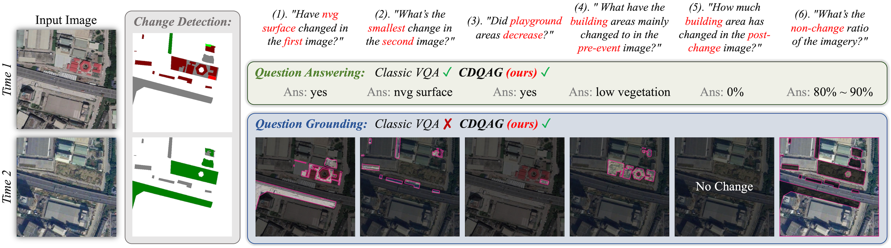
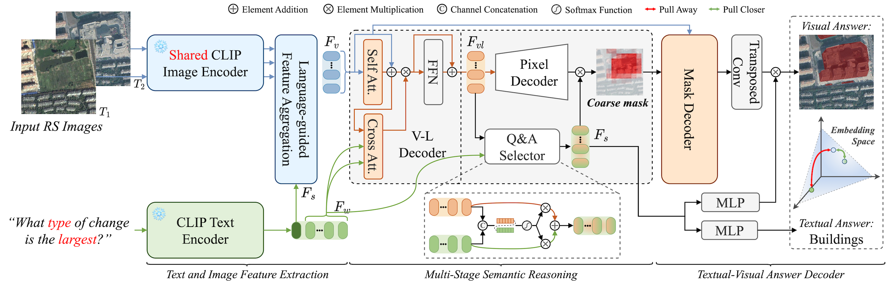

# This repository is the official implementation of "Show Me What and Where has Changed? Question Answering and Grounding for Remote Sensing Change Detection"

## 👋 Task CDQAG
CDQAG takes a pair of remote sensing images and a question as input. 
The output is a textual answer and a corresponding visual segmentation. 
Unlike classic VQA methods that provide only natural language responses, CDQAG can offer both textual answers and correlative visual explanations, which is critical for reasonable remote sensing interpretation.

    

## 🔥 Benchmark dataset QAG-360K
Our QAG-360K dataset: [Remove to avoid violating double-blind]()

    

## 🌟 Simple Baseline Model VisTA

  

## 🌈 Results
QAG-360K

  

CDVQA

  

## 🙏 Acknowledgement
The dataset is based on [HiUCD](https://github.com/Daisy-7/Hi-UCD-S), [SECOND](https://captain-whu.github.io/SCD/), [LEVIR-CD](https://chenhao.in/LEVIR/), and [CDVQA](https://github.com/YZHJessica/CDVQA).
The code is based on [CRIS](https://github.com/DerrickWang005/CRIS.pytorch). We thank the authors for their open-sourced datasets and codes and encourage users to cite their works when applicable.
